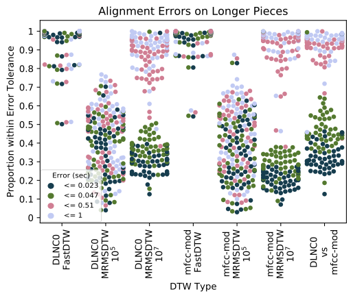

# 具有线性内存的可并行动态时间规整

该仓库包含一种线性内存、可并行的动态时间规整（DTW）算法的实现，简称为“linmdtw”，该算法描述于[1]。该算法可用于对齐重新参数化的多变量时间序列，例如不同管弦乐表演的音频。请参阅笔记本以获取示例。

该仓库还包含 FastDTW [2]、内存受限的多尺度 DTW（MrMsDtw）[3] 和具有 Sakoe-Chiba 带的全局约束 DTW（所谓的“cdtw”）的高效 Cython 实现。请参阅示例以了解用法。

为了简化实现，我们将重点放在欧几里得空间中的多变量时间序列，但欢迎提交拉取请求！

## 安装

要开始使用，只需输入
~~~~~ bash
pip install linmdtw
~~~~~

或者，你可以检出此仓库并运行
~~~~~ bash
pip install -r requirements.txt
python setup.py install
~~~~~

### 音频工具

默认情况下，它只安装对齐一般欧几里得时间序列所需的依赖项。要使用音频功能和音频拉伸工具，你还必须安装音频依赖项
~~~~~ bash
git clone https://github.com/ctralie/linmdtw.git
cd linmdtw
pip install -r requirements.txt
python setup.py install
~~~~~

### GPU 加速

当没有可用的 GPU 时，该库会回退到 CPU 实现，但不推荐这样做。如果你的计算机上有支持 CUDA 的 GPU，你应该通过运行以下命令安装合适版本的 pycuda：

~~~~~ bash
pip install -r requirements_gpu.txt
~~~~~

### 笔记本

安装完成后，查看 notebooks/ 目录以获取示例用法！

## 实验

要复现我们在 [1] 中的实验，首先安装 youtube-dl：

~~~~~ bash
pip install youtube-dl
~~~~~

这用于从 Youtube 下载音频示例（50 对“短”片段和 50 对“长”片段）。然后，进入 <code>experiments/</code> 目录并输入：

~~~~~ bash
python orchestral.py
~~~~~

该文件将下载尽可能多的仍然可用的 URL，并将使用不同的特征将精确对齐与 FastDTW 和 MrMSDTW 进行比较。强烈建议在运行这些实验之前启用 GPU 加速。即便如此，在个人计算机上它们可能需要长达 24 小时。

所有实验完成后，你可以通过运行以下命令生成图表：

~~~~~ bash
python paperfigures.py
~~~~~

下面的图表展示了较长片段上的对齐差异。每对片段有四种不同颜色的点，表示每个片段之间的对应关系比例，这些比例低于对齐差异（23 毫秒、47 毫秒、510 毫秒和 1 秒）。

## 如何引用

如果你在任何工作中使用了这个软件包，请引用：

~~~~~ bash
@inproceedings{tralie2020linmdtw,
  title={Parallelizable Dynamic Time Warping Alignment with Linear Memory},
  author={Tralie, Christopher and Dempsey, Elizabeth},
  booktitle={Proc. of the Int. Soc. for Music Information Retrieval Conf. (ISMIR), in print},
  year={2020}
}
~~~~~

## 参考文献

[1] ``<a href = "http://www.ctralie.com/Research/linmdtw/paper.pdf">具有线性内存的精确、可并行动态时间规整对齐</a>'' 作者 <a href = "http://www.ctralie.com">Christopher Tralie</a> 和 Elizabeth Dempsey。

[2] Stan Salvador 和 Phillip Chan. Fastdtw: 迈向线性时间和空间的准确动态时间规整。发表于 ACM 知识数据与发现 (KDD) 会议，第三届时间序列和顺序数据挖掘研讨会，2004 年。

[3] Thomas Prätzlich, Jonathan Driedger 和 Meinard Müller. 内存受限的多尺度动态时间规整。发表于 IEEE 国际声学、语音和信号处理会议 (ICASSP)，第 569-573 页。IEEE, 2016 年。